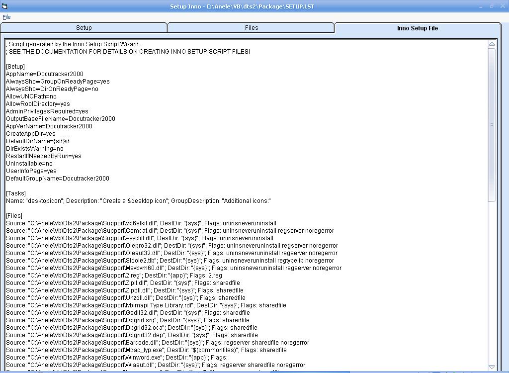



## Setup Inno

### Description

Convert you visual basic setup lst file to an inno setup compatible format. Inno setup is a program to create installation packs.
 
### More Info
 
Setup 'Lst' file to convert

Some functions may be stored in 'Kimmo - CodelibraryNew' obtainable from psc, get that first.

Inno 'Iss' file

             |
---                |---
**Submitted On**   |2004-12-01 13:08:04
**By**             |[Anele Mbanga](https://github.com/Planet-Source-Code/PSCIndex/blob/master/ByAuthor/anele-mbanga.md)
**Level**          |Intermediate
**User Rating**    |5.0 (15 globes from 3 users)
**Compatibility**  |VB 5\.0, VB 6\.0
**Category**       |[Complete Applications](https://github.com/Planet-Source-Code/PSCIndex/blob/master/ByCategory/complete-applications__1-27.md)
**World**          |[Visual Basic](https://github.com/Planet-Source-Code/PSCIndex/blob/master/ByWorld/visual-basic.md)
**Archive File**   |[Setup\_Inno1839261122005\.zip](https://github.com/Planet-Source-Code/anele-mbanga-setup-inno__1-58251/archive/master.zip)

